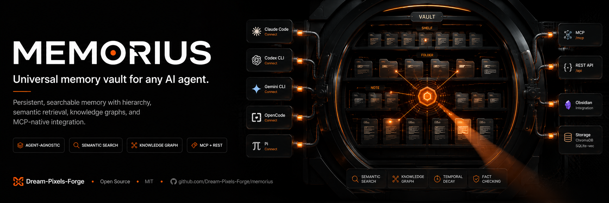

# Memorius


<p align="center">
  <strong>Universal memory vault for any AI agent.</strong>
</p>

<p align="center">
  <a href="https://pypi.org/project/memorius/"></a>
  <a href="https://github.com/Dream-Pixels-Forge/memorius/actions/workflows/test.yml"></a>
  <a href="https://github.com/Dream-Pixels-Forge/memorius/actions/workflows/publish.yml"></a>
  <a href="https://opensource.org/licenses/MIT"></a>
  <a href="https://python.org"></a>
  <a href="https://github.com/Dream-Pixels-Forge/memorius/blob/main/CHANGELOG.md"></a>
</p>

> **Works with Claude Code, Codex CLI, Gemini CLI, OpenClaude, OpenCode, Pi, and any MCP-compatible agent.**
>
> **Landing page:** https://dream-pixels-forge.github.io/memorius/
>
> If you find this project useful, leaving a star ⭐ on the repository is the best way to support my work!


## Why Memorius?

Most AI memory tools lock you into one agent ecosystem. Memorius is **agent-agnostic by design** — the same memory vault works whether you use Claude Code, Codex CLI, Gemini CLI, or any MCP-compatible agent. No vendor lock-in.

| Feature | Memorius | Others |
|---------|----------|--------|
| Agent support | **7 agents** (auto-detected) | Usually 1-3 |
| Protocol | **Open MCP standard** | Proprietary plugins |
| Memory hierarchy | Vault → Shelf → Folder → Note | Flat |
| Temporal decay | Ebbinghaus forgetting curve | - |
| Knowledge graph | Auto-linked memories | - |
| Fact-checking | Contradiction detection | - |
| Cross-encoder reranking | ms-marco-MiniLM-L-6-v2 | - |
| Obsidian integration | Native import/export | - |
| LLM extraction | OpenAI / Ollama / regex backends | - |
| Web augmentation | DuckDuckGo / Tavily fallback | - |
| Dual storage backends | ChromaDB + SQLite-vec | - |
| Self-hosted | No cloud dependency | Often SaaS |
| Open source | MIT license | Varies |

```bash
pip install memorius
```

> **REST API server is included by default** — `fastapi`, `uvicorn`, `pydantic`,
> and `sse-starlette` are now core dependencies. No extra `[rest]` install flag needed.

## Quick Start

```bash
# Initialize a vault
memorius init

# Store a memory
memorius store "The sky is blue because Rayleigh scattering scatters shorter wavelengths more" --vault main --shelf science --folder physics

# Semantic search
memorius search "why is the sky blue"

# Mine memories from a conversation
memorius mine transcript.txt --vault conversations

# LLM-powered structured extraction
memorius extract meeting-notes.txt --backend openai

# Check status
memorius status

# Write a diary entry
memorius diary "session-001" --title "Research findings"
```


## What's New in v1.2.4

### Architecture Improvements
- **Modular VaultEngine** — extracted `SearchModule` (5-stage search pipeline) and `StoreModule` (CRUD operations). VaultEngine reduced from 692 to 328 lines (53% reduction).
- **VectorStore ABC** — `ChromaStore` and `SqliteVecStore` now share an abstract base class for swappable backends.
- **Sealed `_conn()` leakage** — all external callers now use `SQLiteStore` public API (`execute`, `fetchone`, `fetchall`, `transaction`, graph/temporal adapters, import/export methods).
- **Shared Obsidian module** — `memorius/obsidian.py` consolidates helpers used by REST server and CLI.

### Code Quality
- **Type hints** — complete type annotations on `SQLiteStore` public API.
- **Exception documentation** — 30 `except Exception` blocks annotated as best-effort with reasons.
- **Dead code removal** — HNSW switchover path removed from consolidation.
- **26 new tests** — `SearchModule` (7) and `StoreModule` (19) unit tests.

### Fixed
- **Version mismatch** — `__version__` now uses `importlib.metadata.version()` consistently.
- **Legacy test references** — `test_features.py` updated to use `SQLiteStore` public API instead of `_conn()`.

See [CHANGELOG.md](CHANGELOG.md) for full release history.


## Architecture

```
┌──────────────────────────────────────────────────────────────┐
│                         Memorius                             │
├──────────────────────────────────────────────────────────────┤
│  CLI        memorius init | store | search | mine | ...      │
│  MCP        JSON-RPC protocol server (stdin/stdout)          │
│  REST       FastAPI HTTP server (API key auth + rate limit)  │
│  Hooks      Auto-detect: Claude Code, Codex, Gemini, ...    │
│  Obsidian   Import / export notes from Obsidian vaults       │
├──────────────────────────────────────────────────────────────┤
│  Vault Engine (thin orchestrator)                            │
│  ├── SearchModule    5-stage search pipeline                 │
│  │   ├── Filter      folder/note/tags metadata filters       │
│  │   ├── Vector      ChromaDB/sqlite-vec cosine search       │
│  │   ├── Temporal    Ebbinghaus decay scoring                │
│  │   ├── Rerank      Cross-encoder precision ranking         │
│  │   └── Graph       1-hop BFS expansion                     │
│  ├── StoreModule     Memory CRUD operations                  │
│  │   ├── Store       Create with embedding + metadata        │
│  │   ├── Update      Content change + re-embed               │
│  │   ├── Delete      Remove from vector + meta stores        │
│  │   ├── Touch       Record access for decay reinforcement   │
│  │   └── List        Cursor-paginated retrieval               │
│  ├── ChromaStore     Vector search (ChromaDB HNSW)           │
│  ├── SqliteVecStore  Single-file alternative (sqlite-vec)    │
│  ├── SQLiteStore     Metadata & hierarchy (SQLite)           │
│  ├── KnowledgeGraph  Auto-linked memories + contradictions   │
│  ├── TemporalDecay   Ebbinghaus forgetting curve             │
│  └── Embeddings      Pluggable providers (ONNX / SF / OA)   │
├──────────────────────────────────────────────────────────────┤
│  Vault  >  Shelf  >  Folder  >  Note  hierarchy              │
│  Diaries          Session diary entries                      │
│  Mine             Extract memories from transcripts          │
│  Extract          LLM-powered structured extraction          │
│  Consolidate      Cluster + merge duplicate memories         │
│  Factcheck        Contradiction detection with web fallback  │
│  Prune            Decay-based stale memory archival          │
│  Export/Import    JSON or Markdown vault portability          │
├──────────────────────────────────────────────────────────────┤
│  Plugin Gen    →  Generate per-agent plugins                 │
│  Normalizers   →  Import Discord/Telegram/WhatsApp/etc       │
│  Obsidian      →  Bidirectional vault sync                   │
└──────────────────────────────────────────────────────────────┘
```

## Configuration

Config lives at `~/.memorius/config.yaml` (auto-created on `memorius init`):

```yaml
storage:
  path: ~/.memorius/data
  type: chroma            # chroma (default) | sqlite-vec (single-file)

embeddings:
  provider: chroma-default  # chroma-default | sentence-transformers | openai
  model: all-MiniLM-L6-v2

vault:
  default: main

server:
  mcp_port: 8911
  rest_port: 8912
  host: 127.0.0.1

retrieval:
  web_fallback: false        # opt-in: augment thin local recall with web
  web_provider: duckduckgo   # duckduckgo (keyless) | tavily (keyed) | mock (tests)
  tavily_api_key: null       # or set TAVILY_API_KEY env var
  web_min_results: 1         # if ZERO local hits, fall back to web
  web_max_results: 5         # max web results to return
```

Environment variable overrides:

| Variable | Overrides |
|---|---|
| `MEMORIUS_STORAGE_PATH` | `storage.path` |
| `MEMORIUS_STORAGE_TYPE` | `storage.type` |
| `MEMORIUS_EMBEDDINGS_PROVIDER` | `embeddings.provider` |
| `MEMORIUS_DEFAULT_VAULT` | `vault.default` |
| `MEMORIUS_MCP_PORT` | `server.mcp_port` |
| `MEMORIUS_REST_PORT` | `server.rest_port` |
| `MEMORIUS_HOST` | `server.host` |
| `MEMORIUS_OPENAI_API_KEY` | `embeddings.openai.api_key` |
| `MEMORIUS_WEB_PROVIDER` | `retrieval.web_provider` |
| `MEMORIUS_WEB_FALLBACK` | `retrieval.web_fallback` |
| `MEMORIUS_TAVILY_API_KEY` | `retrieval.tavily_api_key` |
| `MEMORIUS_MODEL_CACHE_DIR` | ONNX model cache directory |

## Vector Store Backends

Memorius uses a **VectorStore ABC** (abstract base class) for swappable backends. Both backends implement the same interface (`add`, `delete`, `search`, `get_collections`, `count`, `get_by_ids`):

| Backend | Dependency | Description |
|---|---|---|
| **ChromaDB** (default) | ChromaDB (bundled) | Persistent HNSW cosine search, auto-migration from legacy collections |
| **SQLite-vec** | `pip install memorius[single-file]` | Single-file alternative, no ChromaDB dependency |

Set `storage.type: sqlite-vec` in config or `MEMORIUS_STORAGE_TYPE=sqlite-vec` to use the lightweight backend.

## Embedding Providers

| Provider | Requirement | Quality |
|---|---|---|
| `chroma-default` | ChromaDB (bundled ONNX) | Good (384d) |
| `sentence-transformers` | `pip install memorius[local-embeddings]` | Better (768d+) |
| `openai` | `OPENAI_API_KEY` env var | Best (1536d or 3072d) |

Providers are extensible via `EmbeddingFactory.register()` for custom runtime providers.

## Temporal Decay

Memorius implements the **Ebbinghaus forgetting curve** to rank memories by relevance over time:

- **Decay score** (0–1) = age decay (40%) + recency boost (40%) + access reinforcement (20%)
- **Search ranking** = semantic similarity (60%) + temporal decay (25%) + access frequency (15%)
- `touch(memory_id)` reinforces a memory on read
- Stale memories are detected via decay score threshold or TTL expiry
- **TTL support:** `memorius store "..." --ttl 30` sets `expires_at` in metadata

## Knowledge Graph

- **Auto-linking** on every `store()` call by content proximity (Jaccard word overlap or vector cosine)
- **BFS expansion** from search results (`--expand-graph` on CLI / `expand_graph=True` on MCP)
- **Contradiction edges** persisted by `factcheck` (bidirectional `relation='contradicts'`)
- **Graph statistics** via `memorius stats` or MCP `memorius_graph_stats`

## Cross-Encoder Reranker

Improve search precision with a cross-encoder reranker:

```bash
memorius search "query" --rerank
```

| Provider | Requirement |
|---|---|
| `cross-encoder/ms-marco-MiniLM-L-6-v2` | `pip install memorius[ranker]` |

Adds `__rerank_score__` to memory metadata for transparent ranking.

## Web Search

When local recall is thin, Memorius can optionally augment retrieval with
live web results. This is **local-first and opt-in** — web search never runs
unless you ask for it: the `memorius web` command, the `--web` flag on
`search` / `context` / `factcheck`, or `retrieval.web_fallback: true`.

```bash
# Live web search (keyless DuckDuckGo by default)
memorius web "python 3.13 changelog"

# Use the keyed Tavily provider for higher signal-to-noise
memorius web "python 3.13 changelog" --provider tavily

# Augment a local search with web when local hits are thin
memorius search "latest rust release" --web

# Fact-check with web cross-reference
memorius factcheck "Rust 1.80 was released in July 2024" --web
```

### Providers

| Provider | Key | Notes |
|---|---|---|
| `duckduckgo` (default) | none | Keyless, stdlib-only scraper. Works out of the box. |
| `tavily` | `TAVILY_API_KEY` or `MEMORIUS_TAVILY_API_KEY` | Agent-grade signal-to-noise. Missing key warns and returns `[]` — never crashes. |
| `mock` | n/a | Test double for offline testing. |

### Configuration

```yaml
retrieval:
  web_fallback: false        # opt-in: augment thin local recall with web
  web_provider: duckduckgo   # duckduckgo (keyless) | tavily (keyed) | mock (tests)
  tavily_api_key: null       # or set TAVILY_API_KEY / MEMORIUS_TAVILY_API_KEY
  web_min_results: 1         # fall back to web only when local hits < this
  web_max_results: 5         # max web results to return
```

`MEMORIUS_WEB_PROVIDER`, `MEMORIUS_WEB_FALLBACK`, and `MEMORIUS_TAVILY_API_KEY`
override the corresponding config keys (the raw `TAVILY_API_KEY` is also read
directly). A missing Tavily key never crashes the CLI — it logs a warning and
returns no web results.

## LLM-Powered Memory Extraction

The `extract` command uses an LLM to identify and structure memories from unstructured text:

```bash
memorius extract meeting-notes.txt --backend openai
memorius extract transcript.txt --backend ollama
memorius extract notes.txt --backend regex    # fallback, no LLM required
```

| Backend | Model | Notes |
|---|---|---|
| `openai` | gpt-4o-mini | Requires `OPENAI_API_KEY` |
| `ollama` | llama3.2 | Requires local Ollama server |
| `regex` | n/a | Rule-based fallback, no LLM needed |

Extracts 6 memory categories: `decision`, `preference`, `fact`, `action_item`, `relationship`, `context`. Includes prompt injection protection, 50KB input limit, and validated structured output with confidence scores.

## Memory Consolidation

Clusters similar memories and merges them into consolidated insights:

```bash
memorius consolidate --threshold 0.80 --dry-run
memorius consolidate --vault main
```

Uses O(N^2) pairwise comparison for clustering. Archives originals after consolidation.

## Memory Pruning

Find and archive stale memories based on temporal decay:

```bash
memorius prune --threshold 0.1 --dry-run       # preview stale memories
memorius prune --threshold 0.1                  # soft-archive stale
memorius prune --threshold 0.1 --delete         # hard-delete
```

## Export / Import

Back up and migrate vaults between instances:

```bash
memorius export ./backup --format json          # single JSON file
memorius export ./backup --format markdown      # individual .md files

memorius import ./backup/backup.json            # merge import
memorius import ./backup/backup.json --replace  # overwrite mode
```

JSON export includes hierarchy, memories, diaries, and graph edges (schema versioned). Markdown export creates `.md` files with YAML frontmatter. Uses `SQLiteStore` export/import methods for atomic operations.

## CLI Reference

### Core commands

```bash
memorius init                Initialize a new vault
memorius setup               Download ONNX model + initialize vault
  --force                      Force re-download of model
  --skip-model                 Skip model download
memorius status              Show vault status
memorius store <text>        Store a memory
  --vault, -v                  Vault name (default: main)
  --shelf, -s                  Shelf name (default: default)
  --folder, -f                 Folder name (default: default)
  --note, -n                   Note name (default: default)
  --ttl                        Time-to-live in days (memory expires after N days)
memorius search <query>      Semantic search
  --vault, -v                  Filter by vault
  --shelf, -s                  Filter by shelf
  --folder                     Filter by folder (Chroma metadata)
  --note                       Filter by note (Chroma metadata)
  --tag                        Filter by tag (repeatable; memory must carry ALL supplied tags)
  --n                          Max results (default: 10)
  --expand-graph               Also pull in 1-hop graph-linked memories
  --rerank                     Cross-encoder reranking
  --web                        Augment with web search when local hits are thin
memorius get <id>            Get a single memory by UUID
  --json                       Output as JSON
memorius update <id>         Update memory content/metadata
  --content                    New content (omit to keep existing)
  --metadata                   JSON metadata to shallow-merge
  --json                       Output as JSON
memorius delete <id>         Delete a memory by ID (validation + confirmation)
  --vault, -v                  Vault scope (must match the memory's vault)
  --shelf, -s                  Shelf scope (must match the memory's shelf)
  --yes, -y                    Skip the confirmation prompt
  --dry-run                    Preview what would be deleted
memorius list                List memories with cursor pagination
  --vault                      Filter by vault
  --limit                      Results per page (default: 10)
  --cursor                     Cursor for next page
memorius mine <file|text>    Extract memories from transcript
  --vault, -v                  Target vault (default: main)
  --text                       Treat input as raw text, not a file path
memorius extract <file|text> Extract memories from conversation (LLM)
  --vault                      Target vault (default: main)
  --shelf                      Target shelf (default: extracted)
  --backend                    LLM backend: auto|openai|ollama|regex
memorius diary <session>     Write a diary entry
  --title                      Entry title
  --summary                    Entry summary
  --content                    Entry content
  --vault                      Vault name (default: main)
  --exchange-count             Number of exchanges in session
memorius diaries              List recent diary entries
memorius ls                   Explore vault hierarchy
memorius consolidate         Merge duplicate memories
  --vault                      Filter by vault
  --threshold                  Similarity threshold 0-1 (default: 0.80)
  --dry-run                    Preview without changes
memorius factcheck <stmt>    Fact-check against stored memories
  --vault                      Filter by vault
  --web                        Cross-check with web search
memorius context <query>     Get formatted memory context for injection
  --vault                      Filter by vault
  --max                        Max items (default: 5)
  --web                        Augment with web search
memorius profile <session>   Build session memory profile
  --vault                      Vault name (default: main)
memorius prune               Find/archive stale memories by decay score
  --threshold                  Decay score threshold (default: 0.1)
  --dry-run                    Preview without changes
  --delete                     Hard-delete instead of soft-archive
  --json                       Output as JSON
memorius export <dest>       Export vault to JSON or Markdown
  --format                     json (default) | markdown
memorius import <src>        Import vault from JSON export
  --replace                    Overwrite mode (default: merge)
memorius doctor              Run health checks on the vault
memorius stats               Show vault + memory + graph statistics
memorius web <query>         Live web search
  --provider                   duckduckgo (default) | tavily
  --max                        Max results (default: 5)
memorius serve               Start MCP server (stdio)
memorius serve-rest          Start REST API server
  --port                       Port number
  --host                       Bind address
  --daemon                     Run as background daemon
  --stop                       Stop the running daemon
  --pid-file                   PID file path
memorius config              Show current configuration
  --path                       Print config file path only
memorius --version           Show version
```

### Obsidian integration

```bash
memorius obsidian list                Explore vault structure
  --vault, -v                         Path to Obsidian vault directory
                                      (default: $OBSIDIAN_VAULT_PATH or
                                       ~/Documents/Obsidian Vault)

memorius obsidian import              Import Obsidian notes as memorius memories
  --vault, -v                         Path to Obsidian vault
  --target-vault                      Target memorius vault (default: main)
  --target-shelf                      Target memorius shelf (default: obsidian)
  --tag                               Only import notes with this tag
  --dry-run                           Preview without importing

memorius obsidian export              Export memorius memories as Obsidian notes
  --vault, -v                         Path to Obsidian vault
  --source-vault                      Source memorius vault (default: main)
  --source-shelf                      Filter by shelf (default: all)
  --dry-run                           Preview without exporting
```

Import preserves the file hierarchy: `vault/Subfolder/note.md` maps to
`vault/Subfolder/vault > shelf > folder > note`. YAML frontmatter is parsed
and stored as memory attributes.

## MCP Protocol

MCP is the primary interface for AI agents to interact with Memorius. Connect
any MCP-compatible client by pointing it at the MCP server:

```json
{
  "mcpServers": {
    "memorius": {
      "command": "memorius",
      "args": ["serve"]
    }
  }
}
```

Available MCP tools (21 tools):

| Tool | Description |
|---|---|
| `memorius_status` | Memory vault status |
| `memorius_store` | Store content in vault/shelf/folder/note hierarchy (with `ttl_days`) |
| `memorius_search` | Semantic search (`expand_graph`, `rerank`, `tags`, `cursor` pagination) |
| `memorius_get` | Get a single memory by UUID |
| `memorius_update` | Update memory content/metadata (re-embeds on change) |
| `memorius_delete` | Delete a memory by ID |
| `memorius_list` | List memories with cursor pagination |
| `memorius_mine` | Extract memories from conversation transcript |
| `memorius_extract` | LLM-powered structured memory extraction |
| `memorius_diary_write` | Write session diary entry |
| `memorius_diary_list` | List diary entries |
| `memorius_vault_ls` | Browse vault hierarchy |
| `memorius_consolidate` | Merge duplicate memories, extract insights |
| `memorius_factcheck` | Fact-check a statement against stored memories |
| `memorius_context` | Get formatted memory context for injection |
| `memorius_session_profile` | Build session memory profile for inheritance |
| `memorius_contradictions` | Get memories that contradict a given memory ID |
| `memorius_graph_stats` | Knowledge graph statistics (nodes, edges, relations) |
| `memorius_memory_stats` | Memory tracking statistics (total, active, archived, by vault) |
| `memorius_prune` | Find stale memories by decay score, archive or delete |
| `memorius_doctor` | Run health checks (config, storage, vector store, graph) |

## REST API

The REST server is always available (no extra install flags needed):

```bash
memorius serve-rest
```

Starts a FastAPI server on `http://127.0.0.1:8912` by default.

### Security

- **API key auth:** Set `MEMORIUS_API_KEY` env var; send as `Authorization: Bearer <key>`
- **Rate limiting:** 500 requests/min per IP
- **Request body limit:** Maximum body size enforced
- **CORS:** Restrictive by default (Obsidian app + localhost only)
- **Daemon mode:** `--daemon` / `--stop` with PID file management

### Endpoints

| Method | Path | Description |
|---|---|---|
| GET | `/health` | Health check |
| GET | `/status` | System status |
| GET | `/stats` | Full vault + memory + graph stats |
| GET | `/doctor` | Health checks |
| GET | `/vault` | Browse vault hierarchy |
| GET | `/diaries` | List recent diary entries |
| GET | `/memory/{memory_id}` | Get single memory by UUID |
| GET | `/contradictions/{memory_id}` | Get contradicting memories |
| GET | `/memories` | List memories with cursor pagination |
| GET | `/obsidian` | List notes in Obsidian vault |
| POST | `/store` | Store a memory |
| POST | `/search` | Semantic search |
| POST | `/mine` | Extract memories from transcript |
| POST | `/diary` | Write diary entry |
| POST | `/consolidate` | Merge duplicate memories (requires `confirm=true`) |
| POST | `/extract` | Extract memories from conversation (LLM) |
| POST | `/factcheck` | Fact-check statement against vault |
| POST | `/context` | Get formatted memory context for injection |
| POST | `/prune` | Find and archive stale memories |
| POST | `/obsidian/import` | Import Obsidian notes as memories |
| POST | `/obsidian/export` | Export memories as Obsidian notes |
| PATCH | `/memory/{memory_id}` | Update memory content/metadata |
| DELETE | `/memory/{memory_id}` | Delete a memory |

## Agent Skill Installation

Memorius ships with a ready-to-use agent skill (`skills/memorius/SKILL.md`) for agents that support the Hermes Agent skill format. The skill provides auto-capture rules, smart context injection, session diary templates, and workflow patterns — so agents can use memorius proactively without being told.

### Skill Structure

```
skills/
  memorius/
    SKILL.md              # Full skill definition (auto-capture, context injection, diary rules)
    README.md             # Quick command reference
    .memorius_version     # Version tracker
```

### Installing for Hermes Agent

The skill is designed for [Hermes Agent](https://hermes-agent.nousresearch.com) — copy it into your Hermes skills directory:

```bash
# Copy the skill
cp -r skills/memorius ~/.hermes/skills/

# Verify it's loaded
hermes skills list | grep memorius
```

Once installed, Hermes will automatically detect it and follow the skill's workflows.

### Installing for Other Agents

Agents that don't use the Hermes skill format can still use memorius via MCP or CLI:

| Agent | Install Command |
|-------|----------------|
| Claude Code | `claude mcp add memorius -- memorius serve` |
| Codex CLI | `codex mcp add memorius -- memorius serve` |
| Gemini CLI | `gemini mcp add memorius $(which memorius) serve` |
| Cursor | Add to `.cursor/mcp.json`: `{"mcpServers": {"memorius": {"command": "memorius", "args": ["serve"]}}}` |
| Aider | `aider --mcp-servers memorius=memorius serve` |
| Continue | Add memorius to `.continue/config.json` MCP servers |
| OpenClaw | `openclaw mcp set memorius '{"command":"memorius","args":["serve"]}'` |

See `manifest.yaml` for the full list of supported agents and their install commands.

Copying the SKILL.md file directly may also work for agents with their own skills directory (e.g. `~/.claude/skills/`, `~/.codex/skills/`) — check your agent's documentation.

## Agent Hooks

Memorius includes **universal agent lifecycle hooks** — auto-detecting,
agent-agnostic, and framework-free. Hook scripts are generated per agent:

```bash
memorius-plugin-gen init
# Edit universal-manifest.yaml
memorius-plugin-gen generate
```

### Supported agents (8 adapters)

| Agent | Hook protocol | Events |
|---|---|---|
| **OpenClaude** | `OpenClaude` marker in payload | stop, precompact, session_start |
| **Claude Code** (Anthropic) | `stop_hook_active` / `precompact` | stop, precompact, session_start |
| **Codex CLI** (OpenAI) | `session_id` + `context_dir` | session_start, session_stop, stop, precompact |
| **Gemini CLI** (Google) | `conversation_id` + `extensions` | stop, session_start |
| **OpenClaw** | `openclaw` marker in payload | stop, session_stop, precompact, session_start |
| **OpenCode** (anomalyco/sst) | `provider` dict + `openCodeVersion` | stop, session_stop, session_start, precompact |
| **Pi** (kachow-compatible) | `event` in Pi event set | session_start, session_shutdown, pre_compact, tool_call, turn_end |
| **Generic** | Fallback for unrecognized payloads | Any |

### Hook engine actions (10 types)

| Action | Description |
|---|---|
| `mine_dir` | Read transcript file(s) and mine via VaultEngine |
| `diary` | Write a diary entry |
| `conditional_diary` | Write diary only after N exchanges (interval-based) |
| `command` | Execute a shell command (sanitized via `shlex`) |
| `log` | Log a message |
| `webhook` | POST event payload to a URL (with SSRF protection) |
| `inject_context` | Inject relevant memories into context |
| `consolidate` | Run memory consolidation |
| `factcheck` | Fact-check a statement from event payload |
| (allow/block) | Engine can return `block` to pause agent execution |

### Auto-detection (no config needed)

Hooks are auto-detected from stdin — no `--agent` flag required. Just pipe
agent hook JSON to the memorius hook engine and it figures out which agent
sent the event:

```bash
# Hook engine auto-detects the agent
cat hook-payload.json | memorius-hook mine
cat hook-payload.json | memorius-hook diary
```

You can also force a specific agent with `--agent`:

```bash
memorius-hook mine --agent claude-code
memorius-hook diary --agent opencode
```

Detection priority (most-specific first):
`OpenClaude → Claude Code → Codex → Gemini CLI → OpenClaw → OpenCode → Pi → Generic`

Hook CLI commands:

```bash
memorius-hook run              Process a hook event from stdin
memorius-hook init-config      Generate default ~/.memorius/hooks.yaml
memorius-hook status           Show hook state summary
```

## Plugin Generator

```bash
memorius-plugin-gen list          # Show supported agents
memorius-plugin-gen init          # Create universal-manifest.yaml
memorius-plugin-gen generate      # Generate plugins for all agents
memorius-plugin-gen generate --watch  # Live regeneration on config change
```

Generates plugins for: Claude Code, Codex CLI, Cursor, OpenClaw, and marketplace. Outputs: `plugin.json`, `hooks.json`, hook shell scripts, skill cards, commands, `marketplace.json`, README.

## Conversation Normalizers

```bash
memorius-normalize detect <files>           # Auto-detect format
memorius-normalize convert <file>           # Convert to transcript
memorius-normalize batch <dir>              # Batch convert directory
memorius-normalize pipe                     # Read stdin, write stdout
```

| Format | Description |
|---|---|
| `discord` | Discord channel export JSON (DiscordChatExporter) |
| `telegram` | Telegram Desktop chat export JSON |
| `whatsapp` | WhatsApp plain text export (international + US/EU variants) |
| `generic-json` | Any JSON with `{role, content}`, `{author, text}`, or `{from, text}` |
| `generic-messages` | List of message objects with role/author fields |
| `generic-chat` | Dict with `conversations`/`chats` key |
| `generic-text` | Plain text with speaker: message pairs or `>` transcript markers |

## Context Injection

Formatted memory blocks for agent system prompts:

```python
# Full formatted block with category, vault, confidence, source
format_memory_block(memory)

# Compact format for system prompts
format_for_system_prompt(memories)

# Combines recent diaries + topic search for session continuity
inject_for_session(query, vault)
```

Includes **prompt injection protection** — sanitizes memory content before LLM injection (strips "ignore previous instructions", XML tags, control characters).

## Session Memory Inheritance

```bash
memorius profile <session>    Build session memory profile
```

Builds a session profile analyzing recent diaries, memories, and access patterns. Enables cross-session continuity with: summary, key_decisions, ongoing_tasks, recent_topics, context_memories.

## Health Checks

```bash
memorius doctor
```

Runs 6 checks: config parseable, storage writable, ONNX model present, vector/meta count drift, collection name length, graph health. Returns structured report with ok/warn/fail/skip per check. Uses `SQLiteStore` public API for metadata queries.

## Validation

All inputs are validated for security and correctness:

- **Names:** `^[a-zA-Z0-9_\-]+$`, max 1000 chars
- **Memory IDs:** Must be valid UUID (prevents path traversal)
- **Content:** Max 100KB
- **Search limit:** Max 100 results
- **Diary content:** Max 50KB
- **Request body:** Size limit middleware on REST server

## Thread Safety

- Thread-local SQLite connections
- `threading.Lock()` for all meta store writes
- `threading.Lock()` for sqlite-vec store
- `atexit` handler to close connections

## Security

### Hook Engine
- Template injection prevention: strips shell metacharacters
- Command execution: `shlex.split()` with `shell=False` (no shell injection)
- Webhook SSRF protection: blocks localhost, private IPs, metadata endpoints, non-HTTP schemes

### REST Server
- API key auth via `MEMORIUS_API_KEY` (Bearer token)
- Rate limiting: 500 req/min per IP
- CORS: restrictive by default (Obsidian app + localhost only)
- Path traversal detection on Obsidian export

## Optional Dependencies

```bash
pip install memorius[local-embeddings]  # sentence-transformers
pip install memorius[openai]            # openai SDK
pip install memorius[ranker]            # cross-encoder reranker
pip install memorius[single-file]       # sqlite-vec backend
pip install memorius[all]               # everything above
pip install memorius[dev]               # pytest + pytest-asyncio
```

## Installed CLI Entry Points

| Command | Entry Point |
|---|---|
| `memorius` | Core CLI (init, store, search, mine, etc.) |
| `memorius-hook` | Agent hook engine (run, init-config, status) |
| `memorius-plugin-gen` | Plugin generator (list, init, generate) |
| `memorius-normalize` | Conversation normalizer (detect, convert, batch, pipe) |

## Development

```bash
git clone https://github.com/Dream-Pixels-Forge/memorius.git
cd memorius
python3 -m venv .venv
source .venv/bin/activate
pip install -e ".[dev]"

# Run tests
pytest

# Run specific test modules
pytest tests/test_domain_modules.py -v  # SearchModule + StoreModule tests
pytest tests/test_core.py -v            # Core vault tests

# Run end-to-end
memorius init
memorius store "test memory"
memorius search "test"
memorius serve-rest         # REST server available out of the box
```

### Test Structure

| Test File | Coverage |
|---|---|
| `test_domain_modules.py` | SearchModule (7 tests) + StoreModule (19 tests) |
| `test_core.py` | Core vault operations, config, embeddings |
| `test_feature_*.py` | Feature-specific tests (backup, batch, consolidation, etc.) |
| `test_regression_*.py` | Regression tests for specific bugs |

## License

MIT
